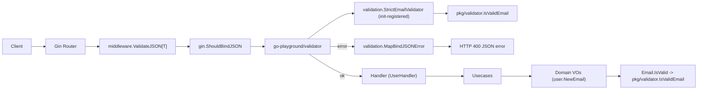

## Validation architecture (validate vs validation vs validator)

### Thành phần và trách nhiệm
- validate (middleware HTTP)
  - File: `internal/interfaces/http/middleware/validate.go`
  - Nhiệm vụ: Bọc `ShouldBindJSON` + giới hạn kích thước body + chuyển lỗi binding/validation thành HTTP 4xx đồng nhất trước khi vào handler.

- validation (helpers/mapping/registration)
  - File: `internal/interfaces/http/validation/validation.go`
  - Nhiệm vụ: 
    - `MapBindJSONError` ánh xạ lỗi từ go-playground/validator → mã/ thông điệp thân thiện.
    - `MapValidationErrors` trả danh sách lỗi dạng `{ field, code, message }` khi cần phản hồi nhiều lỗi.
    - Registry formatter theo tag (`RegisterTagFormatter(tag, fn)`) để có thể thêm format thông điệp cho các tag mới mà không phải sửa code switch-case.
    - Đăng ký custom tag `strict_email` (qua `init()`), ủy quyền kiểm tra cho `pkg/validator`.
    - Helper `IsBodyTooLarge`.

- validator (lõi kiểm tra thuần)
  - File: `pkg/validator/validator.go`
  - Nhiệm vụ: Hàm kiểm tra thuần (vd: `IsValidEmail` dùng `net/mail`), không phụ thuộc Gin; tái sử dụng được ở HTTP và Domain.

### Luồng xử lý (tổng quan)

### Vì sao tách 3 lớp là thực tiễn tốt (best practical)
- Phân tách trách nhiệm rõ ràng:
  - Middleware xử lý cross-cutting HTTP (bind, size limit, phản hồi lỗi HTTP).
  - Helpers/validation xử lý mapping lỗi và đăng ký custom tag, tránh dàn trải logic trong handler.
  - Lõi validator thuần để domain cũng có thể dùng đảm bảo bất biến (invariants) mà không kéo phụ thuộc HTTP.
- Tái sử dụng và kiểm thử tốt hơn: logic thuần nằm ở `pkg/validator` có unit tests riêng; mapping lỗi được test độc lập ở `validation`.
- Giảm rò rỉ concern: domain không phụ thuộc framework HTTP, vẫn có kiểm tra đầu vào mạnh mẽ.

### Có nên hợp nhất không?
- Không khuyến nghị hợp nhất trong hệ thống phát triển lâu dài. Việc gộp `validation` vào `validate` sẽ trộn middleware và mapping/registration, làm khó bảo trì.
- Với codebase rất nhỏ có thể gộp tạm thời, nhưng khi mở rộng nên tách như hiện tại.

